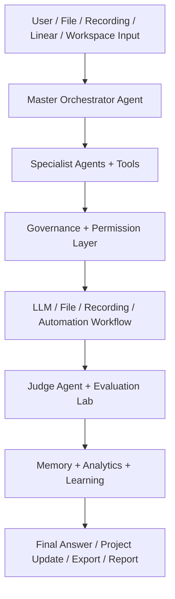

# EvolveAgent AI — Project Summary (current completed: v43.0 MCP Read-Only Adapter)

## v43 — MCP Read-Only Adapter

Turns the v42 mock executor into a **real, opt-in, read-only** executor for a small allow-list of safe actions (`git_current_branch`, `git_list_branches`, `fs_list_directory`, `fs_file_metadata`). Real execution runs only when **all** of: the `MCP_REAL_READONLY` env opt-in is set, the connector is enabled, the request is approved, and the action is allow-listed — otherwise it falls back to the v42 mock. The adapter is **standard-library only: no shell/subprocess, no network, no writes/deletes, no secrets, and it never returns file contents**. Every real path is sandboxed to the repo root with traversal + absolute-path blocking and a sensitive-name denylist (`.env`, keys, `.ssh`, `.git/config`, …). This follows the project's established "real opt-in with mock fallback" pattern; with the opt-in off (default), behaviour is identical to v42.

## v42 — MCP Execution Adapter

A governed **request → approve → run → record** loop layered on top of the v41 connector planning. It reuses the connector planning rules to validate every execution request (blocked-list, allow-list, risk/approval), **auto-approves read-only low-risk actions**, holds all other actions for **explicit human approval**, and runs approved requests through a **mock executor**. Execution is always simulated (`EXECUTION_MODE = "mock"`) — there is **no real MCP server, network call, shell command, or device action, and no secrets are used or returned**. Run-time re-validation blocks any request whose connector has since been disabled. Every step is governance-logged, surfaced in `/api/mcp/executions/*`, and reflected in analytics.

## v41 — MCP Connector Hub

The EvolveAgent MCP Connector Hub prepares and governs tool connections through local connector records, dry checks, approval boundaries, and audit logs. It adds a local **connector registry** with default templates for GitHub, Linear, Filesystem, Git, Context7, Playwright, Slack, Notion, and Desktop Commander; per-connector **risk levels** (low/medium/high) and **modes** (read_only / approval_required / disabled); **env-key readiness checks** that report only whether required keys are set (true/false), never their values; **governance logging** of every stateful action; and an **action-planning** flow that enforces approval/risk rules. There is **no real MCP execution by default, no secrets exposed, no unrestricted shell, and no full desktop control** — high-risk connectors stay approval-required or disabled by default.

> **Version history:** For the implementation-track source of truth from v1–v40, see [`VERSIONS.md`](VERSIONS.md). It documents what actually shipped in code (grounded in service docstrings, README checkpoint narrative, and live API route groups); the official/vision roadmap (Linear epic) numbering may differ from these implementation checkpoints.

## v36–v40 Summary

- **v36 — Autonomous Research + Innovation Lab:** local research, competitors, trends, scored ideas, experiment/prototype plans, innovation reports (no web browsing/scraping).
- **v37 — AI Simulation World:** safe local sandbox for decisions/personas/scenarios with deterministic mock scoring, comparison, reports (no real-world actions).
- **v38 — Multi-User Organization OS:** local organizations, members, roles, permissions, workspace links, activity — **local records only, no production auth**.
- **v39 — AI Hardware / Always-On Companion:** device-readiness and session-planning layer — **no mic recording, no wake-word, no hardware access**; explicit user activation required.
- **v40 — EvolveAgent Operating Layer:** governed orchestration dashboard across v15–v39 — capability map, readiness snapshots, cross-system recommendations, safety boundaries, final report.

> **Not AGI.** The "AGI-style operating layer" is a governed orchestration layer across existing agents, workflows, tools, memory, simulations, and dashboards. **Roadmap after v40 is future-only** (provider expansion, streaming, vector/RAG, deployment) and outside the current local-first, mock/planning-first scope.

## Final Platform Positioning

EvolveAgent OS is a local-first, workspace-aware multi-agent AI platform with governed automation, plugins, analytics, evaluation, and portfolio management.

The current completed roadmap state is **v21.0 — Multi-Modal Real-World Agent**. The active development track is **v22.0 — Industry Workflow Modes**. The v15.0 EvolveAgent OS checkpoint remains the platform base and added the readiness layer below:

- **Unified installer readiness** (`GET /api/os/installer`) — backend/frontend setup steps, required + optional env vars, verification commands, detected readiness, and missing-config warnings. Read-only; it never installs or runs anything.
- **Plugin SDK** (`GET /api/os/plugin-sdk`, `POST /api/os/plugin-sdk/validate`) — declarative plugin manifest schema, permission levels (`read_only`, `plan_only`, `approve_to_edit`, `approve_to_run`, `blocked`), allowed tool types, safety rules, example manifest, and a manifest validator. No remote plugin loading or plugin code execution.
- **SLA monitoring** (`GET /api/os/sla`) — uptime proxy score, latency, success/fallback rate, blocked actions, failed quality/codex jobs, recent incidents, rating, and recommendations from local data only.
- **OS scheduler overview** (`GET /api/os/scheduler`) — aggregated queue/approval/automation health on top of the existing `AgentSchedulerService` (not a replacement).
- **EvolveAgent OS launch panel** (`GET /api/os/summary`) — combined installer readiness, plugin SDK summary, SLA rating, scheduler health, and safety notes, surfaced in a Developer Mode panel. Simple Mode stays clean.

EvolveAgent OS is local-first and governed: not fully autonomous without approval, not a self-training base model, not a production hosted SaaS, and with no unrestricted shell access.

## Architecture Diagram

Full diagrams (system, agent workflow, governance, Linear/Codex, workspace memory, and evaluation/analytics flows) are in [`docs/ARCHITECTURE.md`](docs/ARCHITECTURE.md).

## Short Summary

EvolveAgent AI is a workspace-aware, voice-capable multi-agent AI operating workspace. It combines a polished Jarvis-style interface with Master Agent routing, specialist agents, real OpenAI mode with mock fallback, file and recording analysis, mock image previews, Mission Control goals, custom agents, Project Brain search, safe tool routing, approval workflows, analytics, adaptive learning, Developer Mode transparency, multi-agent departments, workforce marketplace templates, business automation, chief-of-staff planning, business simulation, and multi-modal real-world analysis.

## Full Technical Summary

The project uses a FastAPI backend and Vite React frontend. The backend receives user requests, resolves workspace context, loads relevant memory, classifies the task, routes work through the correct agent workflow, evaluates the result, logs governance and analytics metadata, stores memory, and returns a structured response. The frontend has Simple Mode for normal use and Developer Mode for technical inspection.

The v3.5 checkpoint adds professional UI/UX polish on top of the v3.0 Agent OS foundation:

- Jarvis-style Simple Mode command center
- Responsive Developer Mode sidebar
- Light/dark theme toggle with CSS design tokens
- Theme-consistent panels, composer, markdown/code blocks, cards, and controls
- First-run onboarding walkthrough
- Improved ARIA labels and focus states
- Reduced-motion handling

The v3.0 checkpoint added the first Agent OS foundation on top of the existing v2.x system:

- Project Brain / Knowledge Base search and export
- Cross-session knowledge links
- Memory importance ranking and pinning
- Assistant Tools
- Tool Registry and Tool Router
- Plugin manifest loading
- Developer Mode Tool Trace
- Approval Workflow 2.0
- Approval Queue and Audit UI
- Agent Jobs scheduler and lifecycle controls
- System Prompt Registry
- Kernel Service wrapper around request orchestration
- Jarvis-style Simple Mode foundation

## Key Features

- ChatGPT-style chat UI
- Browser voice input
- Simple Mode and Developer Mode
- Master Orchestrator Agent
- Specialist agents for research, logic, risk, strategy, writing, judging, evolution, memory, files, recordings, images, and planning
- Real OpenAI text mode with mock fallback
- Deep Mode multi-LLM consensus metadata
- File upload and document analysis
- Recording upload and recording analysis
- Mock Image Agent with safe prompt rewriting
- Mission Control goal planning and task graphs
- Custom Agent Builder and Agent Skill Store
- Workspace memory and workspace-scoped analytics
- Project Brain search/export
- Cross-session knowledge links
- Memory importance ranking
- Assistant Tools and Tool Router
- Local plugin manifests
- Approval chains, queue, audit, and rejection records
- Safe file editor and allowlisted command runner
- Governance logging, prompt-injection checks, secret scanning, and permissions
- Adaptive Learning Engine
- Human feedback and analytics dashboard
- Agent Jobs scheduler
- System Prompt Registry
- Kernel Service wrapper
- Professional v3.5 UI polish with Jarvis-style command center, theme tokens, onboarding, accessibility improvements, and responsive layout
- Multi-agent organization with departments, manager/worker/reviewer/auditor roles, department dashboards, and collaboration planning
- Agent Workforce Marketplace with reusable team templates, workflow packs, import/export, ratings, benchmark metadata, and permission profiles
- Business Automation Layer for leads, support triage drafts, document processing, proposals, marketing calendar, and KPI dashboard
- AI Chief of Staff for planning, priorities, reminders, summaries, and next-action guidance
- Autonomous Business Simulator for cost, risk, time, and business-impact comparisons
- Multi-Modal Real-World Agent for screenshot/image/diagram-style analysis, UI issue summaries, and visual workflow interpretation

## What Problem It Solves

Normal chatbots produce one opaque answer. EvolveAgent AI separates routing, context, tools, file/recording analysis, risk checks, writing, judging, feedback, memory, approvals, analytics, and learning into inspectable layers. This makes the system easier to demo, debug, govern, and improve.

## What Makes It Different

- It uses a Master Agent instead of one direct chatbot call.
- It routes tasks through specialist workflows.
- It uses project/workspace memory.
- It can inspect files and recordings.
- It can create goal/task graphs.
- It supports reusable custom agents.
- It can select governed tools and show a tool trace.
- It requires approval for risky actions.
- It tracks quality with judge and per-agent evaluation.
- It has Developer Mode for transparency.
- It uses mock fallback so demos still work without API keys.

## Safety Boundaries

- File edits require approval.
- Commands are allowlisted.
- Destructive file deletion is blocked.
- Unrestricted shell execution is blocked.
- Package installation is blocked.
- `.env`, `.git`, `node_modules/`, `venv/`, uploads, and local runtime data are protected.
- Prompt changes are versioned and reversible.
- Custom agents cannot bypass governance.
- The app does not train or fine-tune the base LLM.
- The app does not silently self-modify.

Correct learning description:

> The system self-optimizes the orchestration layer through prompt versioning, workflow strategy memory, model performance tracking, and user feedback.

## Current Limitations

- No authentication
- No cloud database
- No vector search
- No OCR for scanned PDFs
- No real image-generation API
- No speaker diarization
- No full video frame understanding
- No deployment setup
- JSON storage is for MVP/demo use
- Agent Jobs are local persisted jobs, not distributed workers

## Future Roadmap After v21

- v22.0 — Industry Workflow Modes
- v23.0 — Agent-to-Agent Network
- v24.0 — Self-Healing Project System
- v25.0 — AI Company Brain
- v26.0 — Personal Device Operator / Phone Autopilot
- v27.0 — Real Fine-Tuning + Private Training Lab
- v28.0 — Personal AI Avatar / Voice Twin
- v29.0 — Real-Time Life Operating System
- v30.0 — Universal App Operator
- v31.0+ — team management, SaaS builder, business operator, compliance intelligence, executive board, innovation lab, simulation world, organization OS, and always-on companion tracks

## Earlier Roadmap Items

- Manual UI QA for v3.5 across Simple Mode, Developer Mode, light/dark theme, onboarding, and responsive layout
- Better responsive layout and accessibility
- Light/dark theme tokens
- Onboarding walkthrough
- Server-Sent Events streaming
- Richer approval diff previews
- Vector memory and retrieval
- Real image generation
- OCR/scanned PDF support
- User accounts and team workspaces
- Deployment

## Resume Bullets

- Built EvolveAgent AI, a full-stack multi-agent AI operating workspace using FastAPI, React, and OpenAI with Master Agent routing, specialist workflows, and Developer Mode transparency.
- Implemented real OpenAI mode with mock fallback and Deep Mode consensus metadata so the app remains demoable with or without API keys.
- Added file upload, document analysis, recording analysis, mock image prompts, browser voice input, Mission Control goal planning, and governed custom agents.
- Built Project Brain search across workspace memory, chats, files, recordings, goals, and custom agents with knowledge export, cross-session links, and memory importance ranking.
- Implemented a governed Tool Router with Assistant Tools, plugin manifests, permission levels, and Developer Mode tool tracing.
- Added Approval Workflow 2.0 with approval chains, queue endpoints, audit records, rejection handling, optional webhook notification, and governance logging.
- Built an Agent OS foundation with persisted Agent Jobs, lifecycle controls, health monitoring, System Prompt Registry, and a Kernel Service wrapper around request orchestration.
- Designed safety controls including prompt-injection checks, secret scanning, protected paths, allowlisted commands, approval-gated automation, and no unrestricted shell execution.
- Extended the platform through v21 with multi-agent departments, a workforce marketplace, business automation, AI chief-of-staff planning, autonomous business simulation, and multi-modal real-world analysis.

## Interview Explanation

EvolveAgent AI is a full-stack AI operating workspace I built to explore safe multi-agent orchestration. The system uses a Master Orchestrator Agent to classify requests, retrieve workspace memory, select tools or specialist agents, evaluate output quality, and store feedback and analytics. It supports text, files, recordings, image prompts, voice input, goal planning, custom agents, and approval-gated automation. Developer Mode exposes the workflow trace, provider metadata, consensus candidates, tool trace, approvals, agent jobs, system prompts, and raw JSON. The roadmap now includes multi-agent departments, an agent workforce marketplace, business automation, chief-of-staff planning, simulation, and multi-modal real-world analysis while keeping risky actions behind human approval and governance controls.
