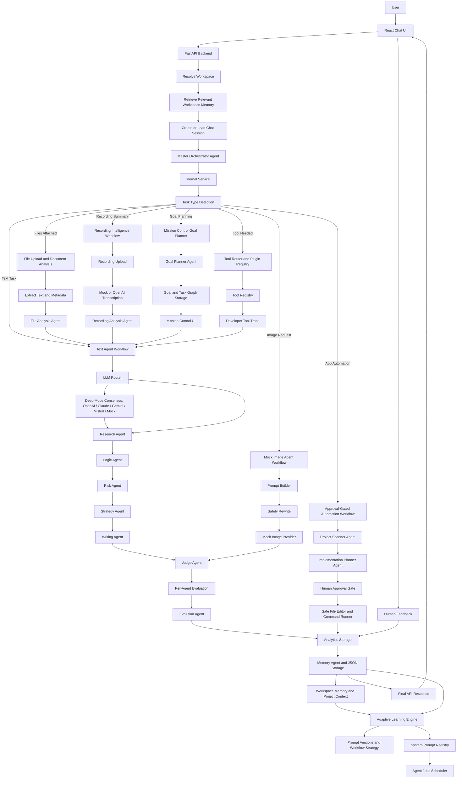

# EvolveAgent AI

**Current version:** v7.5 — Tool Execution and Plugin Polish

**One-line description:** A workspace-aware, voice-capable multi-agent AI operating workspace with a polished Jarvis-style interface, governed tool execution history, plugin validation, real memory intelligence, local vector-style memory retrieval, Master Agent routing, Mission Control, Custom Agent Builder, Project Brain search, approval workflows, agent job scheduling, real multi-LLM consensus, adaptive learning, governance, file/recording analysis, mock image previews, and safe automation planning.

## Project Overview

EvolveAgent AI is a full-stack AI workbench built to demonstrate advanced multi-agent orchestration without overbuilding into a production platform. A Master Orchestrator Agent classifies each request, chooses the correct workflow, coordinates specialist agents, evaluates output quality, stores memory and analytics, and returns one clean answer through a modern chat UI.

The app supports normal text requests, uploaded document analysis, recording/audio transcript summaries, mock image-generation previews, browser voice command input, Mission Control goal planning, custom agents, approval-gated app automation planning, human feedback, and analytics. Simple Mode keeps the user experience clean. Developer Mode exposes the workflow trace, provider metadata, judge results, per-agent evaluation, automation plans, learning reports, recording transcript metadata, file context, goal/task metadata, custom agent metadata, and raw JSON for demos and technical review.

The current v7.5 checkpoint polishes the governed tool layer: tool selections are stored as execution history, read-only tool runs include success and quality metadata, plugin manifests receive stricter validation, and Developer Mode shows recent tool activity without exposing tool internals in Simple Mode.

The v6.0 checkpoint completed the memory intelligence layer: workspace memories are scored, tiered, indexed locally, retrieved semantically, consolidated through tracked jobs, and surfaced in Developer Mode with quality reasons, retention actions, tier history, and recommendations.

The v3.5 checkpoint added professional UI/UX polish: a Jarvis-style Simple Mode command center, responsive Developer Mode sidebar, light/dark theme tokens, onboarding walkthrough, improved accessibility labels, reduced-motion handling, and cleaner theme-consistent panels.

The v3.0 foundation added the operating-system pieces underneath the UI: a Project Brain knowledge base with cross-session links and memory ranking, Assistant Tools, a governed Tool Router and local plugin manifest loader, Approval Workflow 2.0, Agent Jobs, a System Prompt Registry, and a thin Kernel Service around request orchestration.

Workspace Memory lets users create separate workspaces for projects, switch between them in the sidebar, keep chats/files/recordings/goals/custom agents scoped to the active workspace, store project-specific memory, search/edit/delete memory entries, and filter analytics and learning reports by workspace. A default workspace is created automatically so existing data and old requests continue to work.

## Feature List

- ChatGPT-style React chat interface
- Chat sessions and message history
- Master Orchestrator Agent for task classification and routing
- Specialist agents for research, logic, risk, strategy, writing, judging, evolution, memory, file analysis, and image prompts
- Real OpenAI text mode with mock fallback
- Deep Mode multi-LLM consensus across configured OpenAI, Claude, Gemini, and Mistral providers
- Consensus winner, comparison notes, and model tournament tracking in Developer Mode
- Provider/model metadata and fallback visibility
- File upload and text extraction for `.txt`, `.md`, `.json`, `.csv`, code files, `.pdf`, and `.docx`
- File-aware task detection for summary, resume review, code review, data analysis, and document analysis
- Mock Image Agent with safe protected-character prompt rewriting
- Per-agent evaluation with usefulness and clarity scores
- Judge Agent workflow-level scoring
- Evolution Agent recommendations based on judge and per-agent scores
- Human feedback buttons: Helpful, Not helpful, Save as good answer
- Analytics dashboard for runs, scores, latency, fallback usage, file/image tasks, agent usage, and feedback
- Browser voice command input using the Web Speech API
- `app_automation` task detection with safe project scanning and implementation planning
- Approval workflow before any automation apply step
- Safe file editor service with path validation and blocked secret/local-data paths
- Safe command runner with an explicit allowlist for build/test commands only
- Recording upload and transcript analysis for `.mp3`, `.m4a`, `.wav`, `.mp4`, and `.webm`
- `recording_summary` task workflow with mock/OpenAI transcription modes
- Recording Analysis Agent for summaries, key points, action items, decisions, study notes, and Q&A
- Advanced Adaptive Learning Engine for orchestration-level self-optimization reports
- Task-specific strongest/weakest agent insights
- Workflow strategy memory with average score, feedback positive rate, fallback rate, and recommended workflow
- Model routing recommendations for coding, writing, document analysis, recording summaries, and app automation planning
- User preference learning for concise/detailed style, technical/simple tone, bullets, code examples, and step-by-step answers
- Prompt versioning with propose, approve, reject, and rollback endpoints
- Workflow strategy and model performance tracking
- Markdown rendering with code blocks and tables
- Simulated live agent progress while requests run
- Copy, regenerate, edit, delete, rename, and export controls
- Simple Mode and Developer Mode
- JSON-based local storage
- Mission Control goal planning and task graph storage
- Goal Planner Agent for phases, tasks, dependencies, risk, and next-best-task recommendations
- Goal/task APIs for create, list, update, archive, add task, update task, and run task
- Mission Control UI with active goals, progress, task cards, task status, run task, and mark done controls
- Custom Agent Builder with reusable specialist agents
- Agent Skill Store templates for Resume, Code Review, Meeting Notes, File Summary, Pharmacy PA, Construction Bid, Business Analyst, Startup Strategy, Bug Fix, and Study Notes agents
- Governance, analytics, and learning integration for goals and custom agents
- Workspace switcher for organizing projects
- Default workspace fallback for existing chats and no-workspace requests
- Workspace-scoped chats, messages, file uploads, recordings, goals, task graphs, custom agents, feedback, analytics, learning, and governance metadata
- Workspace memory timeline with add, search, filter, edit, and delete controls
- Memory retrieval before agent runs with capped context and Developer Mode visibility
- Workspace-filtered analytics and learning reports
- Real Memory Intelligence with quality scoring, scoring reasons, and quality recommendations
- Long-term memory tiers: hot, warm, and archived
- Tier maintenance with tier transition history, retention actions, and stale-memory review
- Local JSON-backed sparse memory vector index without external vector DB dependency
- Semantic-style memory retrieval using local vector scoring, synonym expansion, quality boosts, and pinned/high-value fallback
- Memory consolidation jobs with preview, apply, immediate run mode, job history, and archived duplicate tracking
- Project Brain / Knowledge Base search across memory, chats, files, recordings, goals, and custom agents
- Cross-session knowledge links between related memories, chats, goals, files, and recordings
- Memory importance ranking with pinning, recency, usage, and importance signals
- Markdown and JSON knowledge export
- Assistant Tools for calculator, random password generation, system info, temperature conversion, and knowledge search
- Tool Registry and Tool Router for governed tool selection
- Local plugin manifest loader with invalid-plugin isolation and governance logging
- Persisted tool execution history with execution IDs, success status, quality scores, and quality notes
- Tool execution summary endpoints for recent history, blocked counts, approval-required counts, and average quality
- Stricter plugin manifest validation for naming, duplicate tools, schema shape, version length, and permission levels
- Developer Mode Tool Trace for selected tools, sanitized inputs, permission level, execution status, result summary, and execution quality
- Developer Mode Tool History panel with recent governed tool activity and manual refresh
- Approval Workflow 2.0 with approval chains, queue endpoints, audit records, rejection/rollback records, and optional webhook notification
- Agent Jobs scheduler with persisted jobs, lifecycle states, pause/resume/cancel/heartbeat controls, health monitoring, and governance logging
- System Prompt Registry integrated with prompt versioning
- Kernel Service wrapper for request intake, routing, scheduling, and governance integration
- Jarvis-style Simple Mode start experience with voice/text-first controls
- Responsive Developer Mode sidebar with mobile overlay behavior
- Light/dark theme toggle backed by CSS design tokens
- First-run onboarding walkthrough
- Improved focus states, ARIA labels, and reduced-motion support
- Theme-consistent panels, composer, markdown/code blocks, cards, and controls

## Tech Stack

**Backend**

- Python
- FastAPI
- Pydantic
- Uvicorn
- OpenAI SDK
- pypdf
- python-docx
- JSON storage

**Frontend**

- Vite
- React
- CSS
- react-markdown
- remark-gfm
- lucide-react

## Architecture



## Full Workflow

1. User sends a message in the chat UI.
2. Frontend calls `POST /api/run`.
3. Backend creates or loads a chat session.
4. Master Agent loads recent conversation context.
5. Master Agent detects task type.
6. If files are attached, file text is extracted and capped before agent use.
7. Text tasks run through specialist agents.
8. Image tasks run through the mock Image Agent workflow.
9. Judge Agent evaluates output quality.
10. Per-agent evaluation scores each agent contribution.
11. Evolution Agent recommends future workflow improvements.
12. Memory and analytics records are saved to JSON.
13. Frontend displays a clean answer in Simple Mode or detailed trace in Developer Mode.
14. User can submit feedback, which is saved and reflected in analytics.

## Workspace Memory and Real Memory Intelligence Workflow

The workspace layer lets the app separate projects such as EvolveAgent AI, resume work, school notes, pharmacy PA support, or business planning.

Workspace behavior:

1. A default workspace is created automatically on startup or first use.
2. `/api/run` accepts `workspace_id`; if omitted, the default workspace is used.
3. Chat sessions, messages, uploaded files, recordings, goals, task graphs, custom agents, feedback, analytics, learning records, and governance events can store `workspace_id`.
4. Before a run, the Master Agent retrieves a small capped set of relevant high-value workspace memories using local semantic-style scoring.
5. Simple Mode stays clean and only shows the final answer.
6. Developer Mode shows whether workspace memory was used, memory IDs, memory type, importance, quality score, tier, and memory context size.
7. Analytics and learning reports can be filtered by `workspace_id`.

Workspace memory entries support:

- `preference`
- `project_fact`
- `decision`
- `summary`
- `task_result`
- `learned_pattern`

v6.0 Memory Intelligence adds:

- quality scoring with specific reasons and recommendations
- hot/warm/archived long-term memory tiers
- tier transition history and retention actions
- local JSON-backed sparse vector-style memory index
- semantic-style retrieval with local vector scoring and synonym expansion
- duplicate memory consolidation preview/apply jobs
- archive/restore controls for low-quality or stale memory
- Memory panel controls for re-score, maintain tiers, rebuild index, create consolidation job, run job, and apply job

This is not model training. The system uses workspace memory as controlled context for future orchestration and answers. The local vector-style index is JSON-backed and intentionally avoids a vector database for the current MVP.

## Mission Control Workflow

Mission Control adds `goal_planning` for larger objectives such as:

- `Build an AI resume analyzer app`
- `Create a full implementation plan for a SaaS app`
- `Break this goal into tasks`

Workflow:

1. Master Agent detects `goal_planning`.
2. Goal Planner Agent creates a goal title, phases, task graph, dependencies, priorities, recommended agents, risk level, and next best task.
3. Goal Service saves the goal to `goals.json` and tasks to `task_graphs.json`.
4. Simple Mode shows the mission plan and task list.
5. Mission Control UI shows active goals, progress, task cards, and status controls.
6. Users can run an individual task through the existing `/api/run` workflow.
7. Task results, run IDs, progress, analytics, learning, and governance metadata are saved.

Goal Mode does not silently execute code changes. Any task that becomes app automation still goes through the existing approval workflow.

## Custom Agent Builder

EvolveAgent AI includes reusable custom agents. Custom agents can be created manually or from templates such as:

- Resume Agent
- Code Review Agent
- Meeting Notes Agent
- File Summary Agent
- Pharmacy PA Agent
- Construction Bid Agent
- Business Analyst Agent
- Startup Strategy Agent
- Bug Fix Agent
- Study Notes Agent

Custom agents are reusable workflow specialists that operate under the same permission, governance, and safety rules as built-in agents. They cannot bypass the prompt-injection firewall, secret scanner, permission system, safe command runner, or governance logging.

## Project Brain and Knowledge Base

The Project Brain layer searches across workspace memory, chats, files, recordings, goals, and custom agents. It supports:

- workspace-scoped knowledge search
- markdown and JSON export
- cross-session knowledge links between related records
- memory ranking based on pinning, importance, usage, recency, quality score, tier, and local semantic retrieval
- Developer Mode visibility for linked items and memory retrieval metadata

This is still JSON-backed and intentionally not a production vector database. v6.0 adds a local sparse vector-style index for semantic retrieval without external infrastructure.

## Assistant Tools and Tool Router

The Assistant Tools layer adds small safe utilities such as:

- calculate
- random password
- system info
- temperature conversion
- knowledge search

The Tool Registry stores tool metadata, permission level, enabled status, and input schema. The Tool Router lets the Master workflow select relevant tools while preserving governance controls. Read-only assistant commands may execute automatically; approval-gated, blocked, or plugin-only tools are traced but not silently executed.

Developer Mode shows:

- per-run Tool Trace with tool name, source, permission level, selected/executed/blocked status, sanitized input, result summary, execution ID, and quality metadata
- Tool History with recent executions, blocked/approval-required counts, average quality, timestamps, and manual refresh
- plugin validation failures through governance logs

Simple Mode does not show tool internals.

Local plugins can be registered through manifest files. Invalid plugins are skipped and logged instead of crashing the app. Manifest validation checks plugin name shape, duplicate tool names, input schema objects, permission levels, and basic metadata limits.

Tool history APIs:

- `GET /api/tools/history`
- `GET /api/tools/history/{execution_id}`
- `GET /api/tools/summary`

## Approval Workflow 2.0

Risky actions create approval chains before execution. The approval system stores pending approvals, decisions, audit records, rollback/rejection metadata, and optional webhook notifications.

Approval rules:

- file edits require approval
- command execution requires approval
- execute-level tools require approval
- rejection blocks the action and records an audit event
- approval/rejection decisions are logged through governance

The frontend has a Developer Mode approval queue and audit view. Simple Mode remains focused on the final user-facing answer or plan.

## Agent OS Foundation

The v3.0 checkpoint adds the first Agent OS backend layer:

- Agent Jobs scheduler with persisted job records
- lifecycle states: queued, running, paused, canceled, completed, failed
- pause, resume, cancel, heartbeat, and start-next endpoints
- job health and stale-job monitoring
- System Prompt Registry for centralized agent prompts
- Kernel Service wrapper around request intake and orchestration
- Developer Mode panels for Agent Jobs and System Prompt Registry

The Kernel Service is intentionally thin at this checkpoint. It preserves `/api/run` behavior while making the orchestration path easier to evolve.

## Text-Agent Workflow

1. **Research Agent** identifies background context and important facts.
2. **Logic Agent** structures reasoning, comparisons, and gaps.
3. **Risk Agent** flags assumptions, missing information, and risks.
4. **Strategy Agent** recommends practical next steps.
5. **Writing Agent** synthesizes the final answer.
6. **Judge Agent** scores workflow quality and per-agent contributions.
7. **Evolution Agent** recommends workflow improvements.
8. **Memory Agent** stores task and summary data.

## Real Multi-LLM Consensus Workflow

Deep Mode keeps optional multi-LLM consensus planning. Normal chat requests still use the existing OpenAI-first text workflow with mock fallback. When Deep Mode is enabled, the Master Agent asks the LLM Router for available consensus providers and compares independent candidates before final synthesis.

Provider behavior:

- In `LLM_MODE=mock`, Deep Mode creates OpenAI, Claude, and Gemini-labeled demo candidates that safely fall back to mock.
- In `LLM_MODE=real`, Deep Mode uses configured providers only.
- If only OpenAI is configured, Deep Mode compares OpenAI against mock.
- Missing Anthropic, Gemini, or Mistral keys do not crash the workflow.
- If a provider call fails, that candidate falls back to mock and records fallback metadata.

Developer Mode shows:

- consensus candidates
- provider/model for each candidate
- selected consensus winner
- judge reason
- disagreement/fallback notes
- model performance records for tournament tracking

Simple Mode still shows only the final user-facing answer.

## File Upload and Document Analysis Workflow

Supported file types:

- `.txt`
- `.md`
- `.json`
- `.csv`
- `.py`
- `.js`
- `.ts`
- `.jsx`
- `.tsx`
- `.html`
- `.css`
- `.pdf`
- `.docx`

Limits:

- Maximum 5 files per upload
- Maximum 10 MB per file
- Text-based PDFs only
- No OCR or scanned PDF support

Workflow:

1. User attaches files from the chat composer.
2. Frontend uploads files with `POST /api/files/upload`.
3. Backend validates type and size.
4. Files are saved under `backend/app/uploads/`.
5. Extracted text is saved under `backend/app/uploads/extracted/`.
6. File metadata is saved to `backend/app/data/files.json`.
7. User sends a prompt with `file_ids`.
8. Master Agent detects file-aware task type.
9. File Analysis Agent summarizes document context.
10. Specialist agents use the file summary and capped extracted text.

## Recording Intelligence Workflow

Supported recording types:

- `.mp3`
- `.m4a`
- `.wav`
- `.mp4`
- `.webm`

Limits:

- Maximum 5 recordings per upload
- Maximum 50 MB per recording
- No speaker diarization yet
- No video frame understanding yet

Transcription modes:

```env
TRANSCRIPTION_MODE=mock
OPENAI_TRANSCRIPTION_MODEL=whisper-1
```

If `TRANSCRIPTION_MODE=openai` and `OPENAI_API_KEY` is configured, the backend attempts OpenAI transcription. If the key is missing or transcription fails, it falls back to mock transcription so demos and tests keep working.

Workflow:

1. User uploads a recording from the chat composer.
2. Frontend calls `POST /api/recordings/upload`.
3. Backend validates type and size.
4. Recording is saved under `backend/app/uploads/recordings/`.
5. Transcription Service creates a transcript using mock or OpenAI mode.
6. Recording metadata is saved to `backend/app/data/recordings.json`.
7. User sends a prompt with `recording_ids`.
8. Master Agent routes the task as `recording_summary`.
9. Recording Analysis Agent extracts summary, key points, action items, decisions, follow-up tasks, study notes, and Q&A.
10. The normal Writing/Judge/Evolution/Memory workflow produces the final response.

## Mock Image Generation Workflow

Image requests route to the Image Agent instead of the normal text workflow.

The Image Agent:

1. Detects image-generation intent.
2. Cleans command wording and prompt punctuation.
3. Rewrites protected-character prompts into safer inspired-character wording.
4. Calls the `mock_image` provider.
5. Returns a user-facing mock preview and prompt.
6. Saves image metadata for Developer Mode and analytics.

Real image APIs are intentionally not included in this checkpoint.

## Voice Command Workflow

The app includes a microphone button near the chat input.

1. User clicks the microphone.
2. Browser Web Speech API listens for a short command.
3. Transcribed text is placed into the chat input.
4. User can edit the transcription before sending.
5. Backend receives `voice_used` and `voice_transcript` metadata.

If the browser does not support speech recognition, the UI shows:

```text
Voice input is not supported in this browser yet.
```

No paid transcription API is required for browser voice commands.

## App Automation Workflow

The app includes `app_automation` for requests such as:

- add a page
- create a component
- fix this bug
- run tests
- change the UI
- implement this feature
- modify this project

The system does **not** silently edit files.

Workflow:

1. Master Agent detects `app_automation`.
2. Project Scanner Agent scans the allowed project root.
3. Scanner ignores unsafe folders and local data such as `.env`, `.git`, `node_modules/`, `venv/`, uploads, and local analytics/feedback files.
4. Implementation Planner Agent prepares a plan.
5. Frontend shows files to change, commands to run, risk level, and approval buttons.
6. User approves or rejects.
7. Safe apply validates paths and can run only allowlisted commands.

Current conservative apply behavior:

- validates planned paths
- blocks unsafe paths
- logs approval/rejection
- runs only allowed build/test commands when included
- does not automatically rewrite source files without a future patch approval step

## Safe Automation Rules

The automation layer blocks `.env` edits, `node_modules/`, `venv/`, `.git/`, uploads, local data memory files, path traversal, destructive deletion, package installation, arbitrary shell commands, `git push`, and secret exposure.

Allowed command runner commands:

- `npm run build`
- `npm test`
- `npm run lint`
- `pytest`
- `python -m pytest`

## Adaptive Learning Engine

The Adaptive Learning Engine does not fine-tune or retrain the base LLM.

Correct wording:

> The system self-optimizes the orchestration layer through prompt versioning, workflow strategy memory, model performance tracking, and user feedback.

It analyzes judge scores, per-agent scores, task types, provider/model usage, fallback status, latency, human feedback, file/image/recording/automation task metadata, workflow outcomes, and user preference signals.

The learning report includes:

- strongest and weakest agents by task type
- best and worst workflows by task type
- recurring failure reasons
- model routing suggestions by task category
- user preference patterns
- recommended next actions
- active and proposed prompt versions

Learning endpoints:

- `GET /api/learning/report`
- `GET /api/learning/prompt-versions`
- `POST /api/learning/propose-prompt`
- `POST /api/learning/approve-prompt`
- `POST /api/learning/reject-prompt`
- `POST /api/learning/rollback-prompt`
- `POST /api/goals`
- `GET /api/goals`
- `GET /api/goals/{goal_id}`
- `PATCH /api/goals/{goal_id}`
- `DELETE /api/goals/{goal_id}`
- `POST /api/goals/{goal_id}/tasks`
- `PATCH /api/goals/{goal_id}/tasks/{task_id}`
- `POST /api/goals/{goal_id}/tasks/{task_id}/run`
- `GET /api/agents/templates`
- `POST /api/agents/custom`
- `GET /api/agents/custom`
- `GET /api/agents/custom/{agent_id}`
- `PATCH /api/agents/custom/{agent_id}`
- `DELETE /api/agents/custom/{agent_id}`

Prompt changes are versioned and reversible. Proposed prompts do not activate without approval.

## Agent Evaluation Workflow

After each workflow, the Judge Agent evaluates each agent output individually:

- agent name
- usefulness score
- clarity score
- contribution summary
- weakness
- improvement suggestion

The Judge Agent also returns:

- overall score
- strongest agent
- weakest agent
- workflow strengths
- workflow weaknesses
- recommendation

The Evolution Agent uses these scores to recommend future workflow improvements. It does not modify code or prompts automatically.

## Feedback and Analytics Workflow

Assistant responses include feedback buttons:

- Helpful
- Not helpful
- Save as good answer

Feedback is saved to `backend/app/data/feedback.json`.

Analytics are saved to `backend/app/data/agent_analytics.json` and exposed through `GET /api/analytics`.

The Analytics panel shows:

- total runs
- average judge score
- average latency
- most common task type
- most used agents
- fallback count
- file task count
- image task count
- feedback summary
- recent runs

## Simple Mode vs Developer Mode

**Simple Mode**

- user messages
- assistant answers
- attached filenames
- image preview and prompt used
- feedback buttons
- copy/regenerate/view details/delete

**Developer Mode**

- task type and confidence
- agents used
- provider/model metadata
- latency and fallback status
- workflow trace
- judge score
- per-agent evaluation
- strongest and weakest agent
- workflow strengths and weaknesses
- file context metadata
- image provider metadata
- evolution notes
- raw JSON toggle

## Environment Variables

Mock mode:

```env
LLM_MODE=mock
DEFAULT_PROVIDER=mock
OPENAI_API_KEY=
OPENAI_TEXT_MODEL=gpt-4o-mini
IMAGE_MODE=mock
IMAGE_PROVIDER=mock_image
TRANSCRIPTION_MODE=mock
OPENAI_TRANSCRIPTION_MODEL=whisper-1
```

Real OpenAI text mode:

```env
LLM_MODE=real
DEFAULT_PROVIDER=openai
OPENAI_API_KEY=your_key_here
OPENAI_TEXT_MODEL=gpt-4o-mini
IMAGE_MODE=mock
IMAGE_PROVIDER=mock_image
TRANSCRIPTION_MODE=openai
OPENAI_TRANSCRIPTION_MODEL=whisper-1
```

Optional real consensus providers:

```env
ANTHROPIC_API_KEY=
ANTHROPIC_MODEL=claude-3-5-sonnet-latest
GEMINI_API_KEY=
GEMINI_MODEL=gemini-1.5-pro
MISTRAL_API_KEY=
MISTRAL_MODEL=mistral-large-latest
```

## Backend Setup

```bash
cd backend
python -m venv venv
source venv/bin/activate
pip install -r requirements.txt
uvicorn app.main:app --reload --port 8000
```

Backend URL:

```text
http://127.0.0.1:8000
```

## Frontend Setup

```bash
cd frontend
npm install
npm run dev -- --host 127.0.0.1 --port 5173
```

Frontend URL:

```text
http://127.0.0.1:5173
```

## Testing Commands

Backend:

```bash
cd backend
pytest
```

Frontend:

```bash
cd frontend
npm run build
```

## Demo Prompts

- Explain how EvolveAgent AI works.
- Add dark mode to this app.
- Run tests for this project.
- Explain the current app architecture.
- Summarize this uploaded document.
- Upload a meeting recording and ask: "Summarize this recording and list action items."
- Upload a lecture recording and ask: "Turn this lecture into study notes."
- Improve my resume for a software engineering internship.
- Review my FastAPI backend architecture.
- Analyze a business idea and find risks.
- Create a 2-minute project demo script.
- Generate an image prompt for a futuristic AI assistant.
- Build an AI resume analyzer app.
- Create a full implementation plan for a SaaS app.
- Break this goal into tasks.
- Upload a resume and ask: "Review this resume for a software engineering internship."
- Upload a CSV and ask: "Analyze this data and identify patterns."
- Upload a code file and ask: "Explain this code and suggest improvements."

## API Endpoints

- `GET /health`
- `POST /api/run`
- `POST /api/workspaces`
- `GET /api/workspaces`
- `GET /api/workspaces/{workspace_id}`
- `PATCH /api/workspaces/{workspace_id}`
- `DELETE /api/workspaces/{workspace_id}`
- `POST /api/workspaces/{workspace_id}/memory`
- `GET /api/workspaces/{workspace_id}/memory`
- `GET /api/workspaces/{workspace_id}/memory/{memory_id}`
- `PATCH /api/workspaces/{workspace_id}/memory/{memory_id}`
- `DELETE /api/workspaces/{workspace_id}/memory/{memory_id}`
- `GET /api/workspaces/{workspace_id}/memory/intelligence`
- `POST /api/workspaces/{workspace_id}/memory/re-score`
- `POST /api/workspaces/{workspace_id}/memory/tiers/maintain`
- `POST /api/workspaces/{workspace_id}/memory/index/rebuild`
- `GET /api/workspaces/{workspace_id}/memory/search`
- `POST /api/workspaces/{workspace_id}/memory/consolidate`
- `POST /api/workspaces/{workspace_id}/memory/consolidation-jobs`
- `GET /api/workspaces/{workspace_id}/memory/consolidation-jobs`
- `GET /api/workspaces/{workspace_id}/memory/consolidation-jobs/{job_id}`
- `POST /api/workspaces/{workspace_id}/memory/consolidation-jobs/{job_id}/apply`
- `POST /api/workspaces/{workspace_id}/memory/{memory_id}/archive`
- `POST /api/workspaces/{workspace_id}/memory/{memory_id}/restore`
- `POST /api/files/upload`
- `POST /api/recordings/upload`
- `POST /api/feedback`
- `GET /api/analytics`
- `GET /api/chats`
- `GET /api/chats/{session_id}`
- `POST /api/chats`
- `PATCH /api/chats/{session_id}`
- `DELETE /api/chats/{session_id}`
- `DELETE /api/chats/{session_id}/messages/{message_id}`
- `GET /api/history`
- `GET /api/memory`
- `GET /api/evolution`
- `GET /api/providers/status`
- `POST /api/automation/apply`
- `GET /api/learning/report`
- `GET /api/learning/prompt-versions`
- `POST /api/learning/propose-prompt`
- `POST /api/learning/approve-prompt`
- `POST /api/learning/reject-prompt`
- `POST /api/learning/rollback-prompt`
- `GET /api/workspaces/{workspace_id}/knowledge`
- `GET /api/workspaces/{workspace_id}/knowledge/search`
- `GET /api/workspaces/{workspace_id}/knowledge/export`
- `POST /api/workspaces/{workspace_id}/knowledge/links`
- `GET /api/workspaces/{workspace_id}/knowledge/links`
- `DELETE /api/workspaces/{workspace_id}/knowledge/links/{link_id}`
- `GET /api/assistant/commands`
- `POST /api/assistant/commands/{name}`
- `GET /api/tools`
- `POST /api/tools/register`
- `GET /api/tools/{name}`
- `GET /api/plugins`
- `GET /api/approvals`
- `GET /api/approvals/{approval_id}`
- `POST /api/approvals/{approval_id}/decision`
- `GET /api/approvals/audit`
- `POST /api/agent-jobs`
- `GET /api/agent-jobs`
- `GET /api/agent-jobs/{job_id}`
- `POST /api/agent-jobs/{job_id}/pause`
- `POST /api/agent-jobs/{job_id}/resume`
- `POST /api/agent-jobs/{job_id}/cancel`
- `POST /api/agent-jobs/{job_id}/heartbeat`
- `POST /api/agent-jobs/start-next`
- `GET /api/agent-jobs/health`
- `GET /api/system-prompts`
- `GET /api/system-prompts/{agent_name}`
- `POST /api/system-prompts/{agent_name}`
- `GET /api/linear/status`
- `GET /api/linear/issues`
- `GET /api/linear/issues/{issue_id}`
- `POST /api/linear/issues/{issue_id}/sync`
- `POST /api/linear/issues/{issue_id}/select`
- `POST /api/linear/issues/{issue_id}/run`
- `POST /api/linear/issues/{issue_id}/comment`
- `POST /api/linear/issues/{issue_id}/complete`
- `GET /api/linear/links`
- `GET /api/linear/poll/status`
- `POST /api/linear/poll/run-once`
- `GET /api/linear/issues/{issue_id}/cursor-handoff`
- `POST /api/linear/issues/{issue_id}/cursor-verify`
- `POST /api/linear/issues/{issue_id}/codex-run`
- `GET /api/codex/jobs`
- `GET /api/codex/jobs/{job_id}`

## Linear and Codex Worker Backend

The EvolveAgent frontend no longer includes a Linear panel. Linear is best managed in the Linear app itself. The backend still includes optional Linear/Codex automation services for local development workflows.

When configured server-side, the backend can:

1. Poll Linear for issues moved to **In Progress**.
2. Create a `linear/evo-*` branch.
3. Write a handoff file under `docs/linear-handoffs/`.
4. Trigger a guarded Codex worker job when explicitly enabled.
5. Run verification through the existing test/build checks.
6. Post completion or failure comments back to Linear.

Required configuration stays in `backend/.env` only. Linear API keys are never exposed in frontend responses or logs. Full autonomous mode remains disabled by default and should only be enabled after manual validation.

## Limitations

- No authentication
- No cloud database
- No deployment setup
- No Docker
- No vector database or RAG search
- No OCR or scanned PDF support
- No real image-generation API
- No speaker diarization
- No full video frame understanding
- No autonomous file editing
- No self-modifying agents
- No unrestricted shell execution
- No package installation through automation
- No destructive file deletion
- File context is capped before being sent to agents
- Analytics are JSON-based for MVP simplicity

## Safety

EvolveAgent AI is a decision-support and productivity tool. It does not provide legal, medical, financial, or professional advice. Human review is required before using outputs for important decisions.

The system stores workflow history, feedback, and analytics for future optimization, but it does **not** train itself, silently modify its own code, or autonomously rewrite agents.

Automation safety rules:

- File edits require explicit user approval.
- Command execution is restricted to an allowlist: `npm run build`, `npm test`, `npm run lint`, `pytest`, and `python -m pytest`.
- Destructive file deletion is not supported.
- Unrestricted shell execution is not supported.
- Package installation is not supported through automation.
- `.env`, `.git`, `node_modules/`, `venv/`, uploads, and local data/analytics files are blocked from editing.
- Prompt/workflow learning proposes changes only; prompt versions require approval and can be rolled back.

## Future Improvements

- Server-Sent Events streaming
- Additional model routing policies and cost tracking
- Real image API
- OCR/scanned PDF support
- Production-grade vector DB or embedding provider integration
- File search across prior uploads
- Deployment
- Agent performance dashboard improvements
- Human feedback trends over time
- User authentication and team sharing

## Resume Bullets

- Built EvolveAgent AI, a ChatGPT-style multi-agent AI workspace using FastAPI, React, and OpenAI with a Master Orchestrator Agent for task classification and routing.
- Designed specialist agents for research, logic analysis, risk detection, strategy planning, final writing, judging, evolution feedback, memory, file analysis, and image prompt generation.
- Implemented real OpenAI text mode and optional multi-LLM consensus across configured providers, with mock fallback so the app can run safely with or without API keys.
- Added chat sessions, message history, message controls, markdown rendering, export, and JSON-based local memory.
- Built file upload and document analysis for resumes, PDFs, CSVs, markdown, JSON, and code files with extracted-text storage and file-aware task detection.
- Added recording upload and mock/OpenAI transcription support for MP3, M4A, WAV, MP4, and WEBM recordings with transcript summaries, action items, decisions, study notes, and Q&A.
- Implemented per-agent evaluation, human feedback, and workflow analytics to measure agent usefulness, clarity, latency, fallback usage, and task trends.
- Created Simple Mode for clean user-facing responses and Developer Mode for inspecting provider metadata, consensus candidates, selected model winner, workflow trace, judge scores, per-agent evaluation, file context, and raw JSON.
- Added browser voice input, approval-gated app automation planning, safe project scanning, allowlisted command execution, and an Adaptive Learning Engine for orchestration-level optimization.
- Implemented a mock Image Agent with protected-character prompt rewriting and mock preview generation.
- Added Mission Control with goal planning, task graph storage, progress tracking, runnable subtasks, and goal/task analytics.
- Built a governed Custom Agent Builder with reusable specialist agents and prebuilt Agent Skill Store templates.
- Added workspace-scoped project memory with a memory timeline, relevant memory retrieval, workspace-filtered chats/goals/agents, and workspace-specific analytics/learning reports.
- Implemented a real memory intelligence layer with quality scoring, hot/warm/archive tiers, tier transition history, local sparse vector-style indexing, semantic retrieval, duplicate consolidation jobs, and Developer Mode memory controls.
