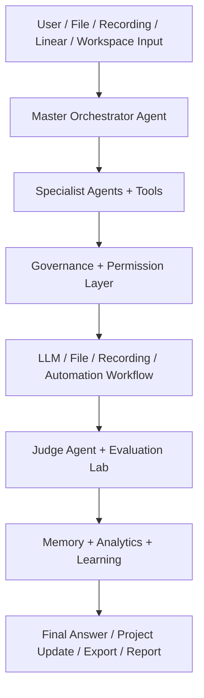
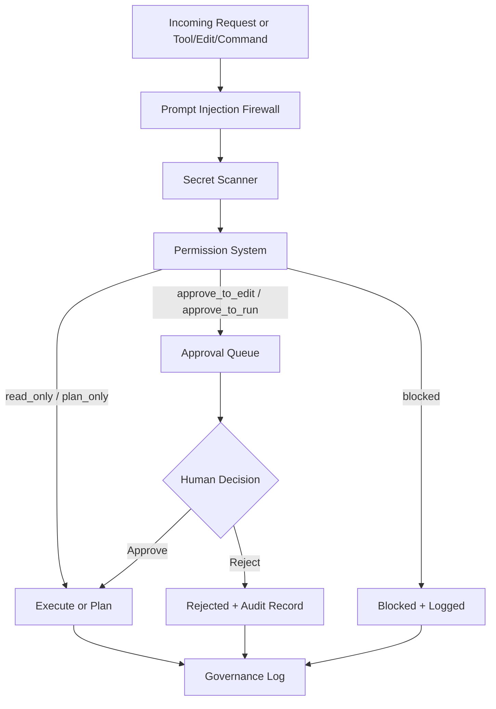
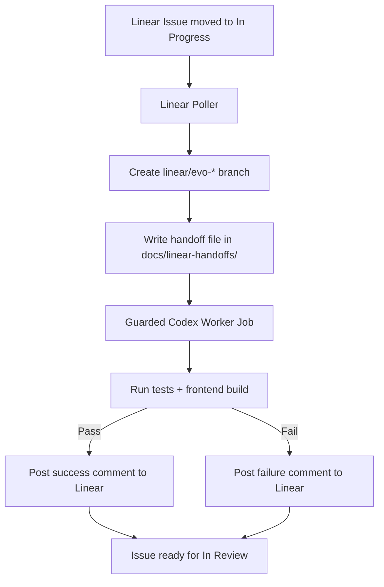
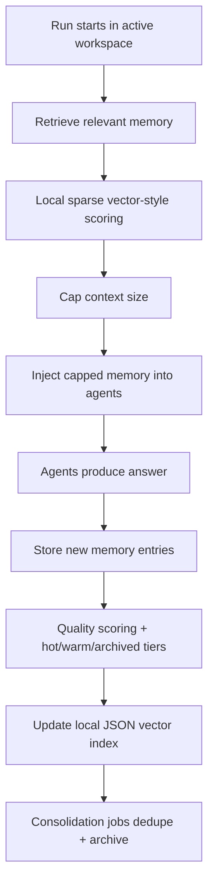
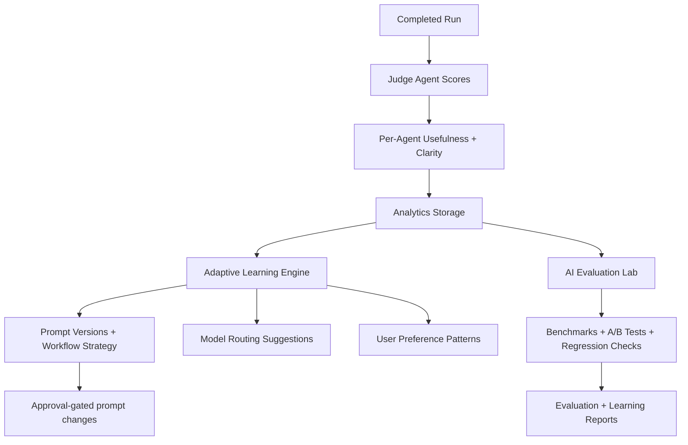

# EvolveAgent AI — Architecture

EvolveAgent AI is a local-first, workspace-aware multi-agent AI operating system built with FastAPI, React, real LLM integrations, JSON-based storage, and governed automation.

This document collects the system's architecture diagrams. All diagrams use Mermaid and render directly in GitHub markdown.

---

## 1. High-Level System Diagram

The Master Orchestrator Agent classifies each request, routes it through the correct workflow, coordinates specialist agents under the governance layer, evaluates the result, stores memory and analytics, and returns one clean response. Simple Mode shows only the answer; Developer Mode exposes every layer.

---

## 2. Agent Workflow Diagram

```mermaid
flowchart TD
    IN[Request + Workspace Context] --> DET[Task Type Detection]

    DET -->|Text| RES[Research Agent]
    DET -->|File| FILE[File Analysis Agent]
    DET -->|Recording| REC[Recording Analysis Agent]
    DET -->|Image| IMG[Image Agent]
    DET -->|Goal| GOAL[Goal Planner Agent]
    DET -->|Automation| AUTO[Project Scanner + Planner]

    FILE --> RES
    REC --> RES
    RES --> LOGIC[Logic Agent]
    LOGIC --> RISK[Risk Agent]
    RISK --> STRAT[Strategy Agent]
    STRAT --> WRITE[Writing Agent]
    WRITE --> JUDGE[Judge Agent]
    JUDGE --> EVAL[Per-Agent Evaluation]
    EVAL --> EVO[Evolution Agent]
    EVO --> MEM[Memory Agent]
    MEM --> OUT[Final Response]

    IMG --> JUDGE
    GOAL --> OUT
    AUTO --> APPROVE[Approval Gate]
    APPROVE --> OUT
```

Specialist agents run in a pipeline: research → logic → risk → strategy → writing, then judge and evolution feedback, then memory. File, recording, image, goal, and automation tasks branch into the pipeline at the right point.

---

## 3. Governance Workflow Diagram

Every risky action passes the prompt-injection firewall and secret scanner, then the permission system. Edit/run actions require human approval; blocked actions are denied. All decisions are written to the governance log with an audit trail.

---

## 4. Linear / Codex Workflow Diagram

The Linear/Codex worker is optional and server-side only. Keys live in `backend/.env` and are never exposed to the frontend. Full autonomous mode is disabled by default; verification (tests + build) gates every completion.

---

## 5. Workspace Memory Flow

Workspace memory is scoped per project. Before each run, a small capped set of high-value memories is retrieved using local semantic-style scoring. New results are scored, tiered, indexed, and periodically consolidated — all JSON-backed, with no external vector database.

---

## 6. Evaluation / Analytics Flow

Judge and per-agent scores feed analytics, which drives the Adaptive Learning Engine and the AI Evaluation Lab. The learning layer self-optimizes the orchestration layer — prompt versions, workflow strategy, model routing, and user preferences — and proposed prompt changes are approval-gated. The base LLM is never retrained.

---

## Safety Boundaries (Architecture-Level)

- No unrestricted shell execution — only an allowlist of build/test commands.
- No silent file edits — edits require explicit approval.
- Approval required for all risky (edit/run) actions.
- Secrets are redacted by the secret scanner.
- Prompt injection is checked by the firewall on every request.
- Governance logs are stored for every decision.
- The base LLM is not self-trained; only the orchestration layer self-optimizes.
